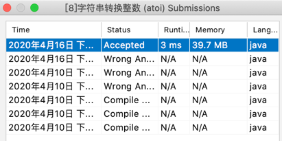

# 0416-字符串转换整数

凡事要一定看清题，当然面试的时候要考虑清楚面试官提供的条件，考虑好边界情况。

下面我展开说下我遇到的问题以及我的思考思路，还有因审题问题导致的弯路。

我们先阅读下这个题目吧

```
请你来实现一个 atoi 函数，使其能将字符串转换成整数。 
首先，该函数会根据需要丢弃无用的开头空格字符，直到寻找到第一个非空格的字符为止。
接下来的转化规则如下： 
 
 如果第一个非空字符为正或者负号时，则将该符号与之后面尽可能多的连续数字字符组合起来，形成一个有符号整数。 
 假如第一个非空字符是数字，则直接将其与之后连续的数字字符组合起来，形成一个整数。 
 该字符串在有效的整数部分之后也可能会存在多余的字符，那么这些字符可以被忽略，它们对函数不应该造成影响。 
注意：假如该字符串中的第一个非空格字符不是一个有效整数字符、字符串为空或字符串仅包含空白字符时，则你的函数不需要进行转换，即无法进行有效转换。 
在任何情况下，若函数不能进行有效的转换时，请返回 0 。 
本题中的空白字符只包括空格字符 ' ' 

```

以上是文字叙述。我单独提取出来画个重点吧。（其实就是我当时做的时候没有读清楚的）

解析：
1、尽可能多连续数字
```
如果第一个非空字符为正或者负号时，则将该符号与之【后面尽可能多】的【连续】数字字符组合起来，形成一个有符号整数。 
```
2、这个告诉我们一个问题，直接上例子 123abc 那么 abc 舍去不会报错 返回结果就是123
```
该字符串在有效的整数部分【之后】也可能会存在【多余的字符】，那么这些字符可以被忽略，它们对函数不应该造成影响。
```
3、官方发的特殊情况了  非空格字符。 现在我们是字符串转整数  - + 也是有效的 这个要注意。
```
假如该字符串中的【第一个非空格字符】不是一个有效整数字符、字符串为空
或字符串仅包含空白字符时，则你的函数不需要进行转换，即无法进行有效转换。 
在任何情况下，若函数不能进行有效的转换时，请返回 0 。

本题中的空白字符只包括空格字符 ' ' 
```

我挑一个示例说明下
1、边界考虑
```
// 输入: "-91283472332"
//输出: -2147483648
//解释: 数字 "-91283472332" 超过 32 位有符号整数范围。
//     因此返回 INT_MIN (−231) 。
```

总结下 
字符串顺序读，排除空 ' '，获取到 - + 或者数字 开始计算，如果非空后第一个字符不属于 （-，+，数字）则认为无法转换返回0

思路：

1、判断字符串非空
```
if (null == str || "".equals(str)) {
            return 0;
}
```
2、过滤掉空直到不是空的字符
```
//排除全部空格情况
while (i < len && strArr[i] == ' ') {
    i++;
}
//排除字符串空了
if (i == len){
    return 0;
}
```
3、正负值，还有边界情况，见解析：3
```
//取正负值
boolean flag = false;
if ('-' == strArr[i] && y == 0) {
    flag = true;
    i++;
}else if ('+' == strArr[i] && y == 0) {
    flag = false;
    i++;
}else if (!Character.isDigit(strArr[i])){
    return 0;
}
```

4、int 范围
```
if ((Integer.MAX_VALUE - tmp) / 10 < y) {
    return flag ? Integer.MIN_VALUE : Integer.MAX_VALUE;
}
```

以上是我个人的考虑。如果需要我的解题思路过程的代码可以私我。就不贴出来了。



#-------------------------
一下是完整的问题以及题解
```

//请你来实现一个 atoi 函数，使其能将字符串转换成整数。 
//
// 首先，该函数会根据需要丢弃无用的开头空格字符，直到寻找到第一个非空格的字符为止。接下来的转化规则如下： 
//
// 
// 如果第一个非空字符为正或者负号时，则将该符号与之后面尽可能多的连续数字字符组合起来，形成一个有符号整数。 
// 假如第一个非空字符是数字，则直接将其与之后连续的数字字符组合起来，形成一个整数。 
// 该字符串在有效的整数部分之后也可能会存在多余的字符，那么这些字符可以被忽略，它们对函数不应该造成影响。 
// 
//
// 注意：假如该字符串中的第一个非空格字符不是一个有效整数字符、字符串为空或字符串仅包含空白字符时，则你的函数不需要进行转换，即无法进行有效转换。 
//
// 在任何情况下，若函数不能进行有效的转换时，请返回 0 。 
//
// 提示： 
//
// 
// 本题中的空白字符只包括空格字符 ' ' 。 
// 假设我们的环境只能存储 32 位大小的有符号整数，那么其数值范围为 [−231, 231 − 1]。如果数值超过这个范围，请返回 INT_MAX (231
// − 1) 或 INT_MIN (−231) 。 
// 
//
// 
//
// 示例 1: 
//
// 输入: "42"
//输出: 42
// 
//
// 示例 2: 
//
// 输入: "   -42"
//输出: -42
//解释: 第一个非空白字符为 '-', 它是一个负号。
//     我们尽可能将负号与后面所有连续出现的数字组合起来，最后得到 -42 。
// 
//
// 示例 3: 
//
// 输入: "4193 with words"
//输出: 4193
//解释: 转换截止于数字 '3' ，因为它的下一个字符不为数字。
// 
//
// 示例 4: 
//
// 输入: "words and 987"
//输出: 0
//解释: 第一个非空字符是 'w', 但它不是数字或正、负号。
//     因此无法执行有效的转换。
//
// 示例 5:
//
// 输入: "-91283472332"
//输出: -2147483648
//解释: 数字 "-91283472332" 超过 32 位有符号整数范围。
//     因此返回 INT_MIN (−231) 。
//
// Related Topics 数学 字符串

```

```java
class Solution {
    public int myAtoi(String str) {
        if (null == str || "".equals(str)) {
            return 0;
        }
        //转换数组
        char[] strArr = str.toCharArray();
        int len = strArr.length;
        int i = 0;
        int y = 0;
        //排除全部空格情况
        while (i < len && strArr[i] == ' ') {
            i++;
        }
        if (i == len){
            return 0;
        }
        //取正负值
        boolean flag = false;
        if ('-' == strArr[i] && y == 0) {
            flag = true;
            i++;
        }else if ('+' == strArr[i] && y == 0) {
            flag = false;
            i++;
        }else if (!Character.isDigit(strArr[i])){
            return 0;
        }

        while (i < len) {
            if (Character.isDigit(strArr[i])) {
                int tmp = strArr[i] - '0';
                if ((Integer.MAX_VALUE - tmp) / 10 < y) {
                    return flag ? Integer.MIN_VALUE : Integer.MAX_VALUE;
                }
                y = y * 10 + tmp;
            } else {
                break;
            }
            i++;
        }


        return flag ? -y : y;

    }
}

```
