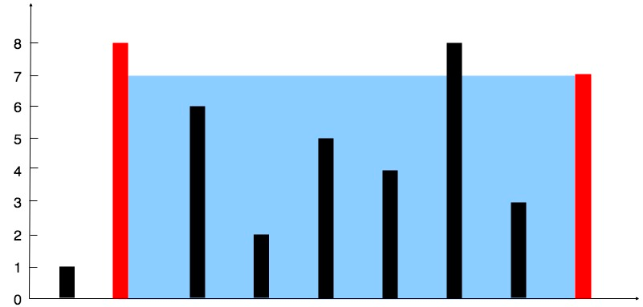

# 盛最多水的容器

  我们先看题：
   
```
给你 n 个非负整数 a1，a2，...，an，
每个数代表坐标中的一个点 (i, ai) 。
在坐标内画 n 条垂直线，
垂直线 i 的两个端点分别为 (i, ai) 和 (i, 0)。
找出其中的两条线，
使得它们与 x 轴共同构成的容器可以容纳最多的水。

说明：你不能倾斜容器，且 n 的值至少为 2。

```
图例，蓝色部分代表水。

```

图中垂直线代表输入数组 [1,8,6,2,5,4,8,3,7]。
在此情况下，容器能够容纳水（表示为蓝色部分）的最大值为 49。
```
  
  我在做的时候第一思路就是双指针，这个相对算是比较典型的双指针了。
  
  一个从头开始，一个从尾部开始，当两指针相遇就退出。
  
  如果是双指针就要确定那个指针移动，目前取盛水最多的，水高度不会超过当前最小值。
  
  图例中是可以看到，[8,7]的区间，水值是49。
  
  那我们就是两个坐标的较小值移动指针。
  
上代码吧

```java
class Solution {
    public int maxArea(int[] height) {

        int max = 0;//最大值
        int i = 0;//左指针
        int j = height.length - 1;//右指针
        while (i < j) {
        
            //算水值
            int tmp = Math.min(height[i], height[j]) * (j - i);
            if (tmp > max) {
                max = tmp;
            }
            //指针位移
            if (height[i] < height[j]){
                i ++;
            }else {
                j --;
            }
        }
        return max;
    }
}

```