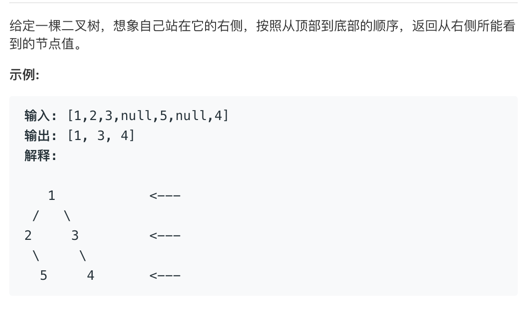

# 二叉树的右视图


题目：


##二叉树遍历问题

以下跟题目没关系：

#### 1.深度优先搜索(Depth First Search)

一条路走到黑，然后再走别的路。递归？

上一个例子：
```
     1
   /   \
  2     3
 / \     \
4   5     6
```

深度怎么走？结果是什么呢？

[1,2,4,5,3,6]

是我们想要的吗？对没错就是这个样子。

接下来我们要思考下，怎么可以满足这个情况。
常规的解法有两种 一个是引入了栈（stack） 一个是递归

先说下栈的特性：先进后出

这里不多废话，直接分析代码吧。

下面是 利用了栈的结构实现的
```java
class Dfs{
    public static class TreeNode {
            int val;
            TreeNode left;
            TreeNode right;
        }
    
    public List<Integer> dfs(TreeNode root) {
        Stack<TreeNode> stack = new Stack<TreeNode>();
        List<Integer> list = new LinkedList<Integer>();

        if (root == null)
            return list;

        //压入根节点
        stack.push(root);

        //然后就循环取出和压入节点，直到栈为空，结束循环
        while (!stack.isEmpty()) {
            //取出来
            TreeNode t = stack.pop();
            //先压入 右节点
            if (t.right != null)
                stack.push(t.right);
            //先压入 右节点
            if (t.left != null)
                stack.push(t.left);
            list.add(t.val);
        }
        return list;
    }
}

```

递归的方法：

```java
class DFS {

  public List<Integer>  recursion(TreeNode root){
      List<Integer> list = new LinkedList<Integer>();
      dfs(list,root);
      return list;
  }
  private void dfs(List<Integer> list, TreeNode node) {
      if (null == node)
          returen;
      

      if (node != null) {
          list.add(node.val);
       
      
      //每次先添加左节点，直到没有子节点点，返回上一级
      dfs(node.left);
      dfs(node.right);
      }
  }
}

```

#### 2.广度优先搜索(Breadth First Search)

处理思想是对每一层的节点依次访问，访问完成后进入下一层，依次操作，直至到下一层。


```java
class  BFS {
  public List<Integer> bfs(TreeNode root) {
    Queue<TreeNode> queue = new LinkedList<TreeNode>();
    List<Integer> list = new LinkedList<Integer>();

    if (root == null)
        return list;
    //跟节点放入队列中
    queue.add(root);

    while (!queue.isEmpty()) {
        TreeNode node = queue.remove();
        //从左至右放入节点。
        if (node.left != null)
            queue.add(node.left);

        if (node.right != null)
            queue.add(node.right);

        list.add(node.val);
    }
    return list;
  } 
}
```

## 上解题思路，最右视角，那怎么考虑？

1、先考虑最右侧的深度，再考虑树的总深度
上一个例子：
```
         1
       /   \
      2     3
     / \     \
    4   5     6
   / \
  7   8
```
怎么解释呢，最右侧深度 就是1-3-6的长度

那假设 1 的深度是 0 那么6的深度是 2

2、树的总深度是否大于最右深度？

同一的例子， 1-2-4-8 的长度是大于 1-3-6的长度

说明8 被露出来了，也就是被我们看到了。

那么问题来了，我们怎样可以取到8？

我们要取最右，那我们可以考虑从右侧节点开始遍历。

```java
class Solution {
    //这里我们先用递归处理下。
    List<Integer> res = new ArrayList<>();
    public List<Integer> rightSideView(TreeNode root) {
        //0 本身就是一个计数，记录下深度
        dfs(root, 0);
        return res;
    }
    publce dfs(TreeNode node ,int depth){
        //空 返回
        if (null == node) 
            return;
        
        if(depth == res.size()){
            res.add(node.val);
        }

        depth++;
        //从最右开始遍历
        dfs(node.right,depth);
        dfs(node.left,depth);
    }   
}

```

看完代码，是不是发现跟上面的一个代码很像。唯一多了一个深度的记录。

悟一道理，学习算法需要循序渐进，归纳总结。


