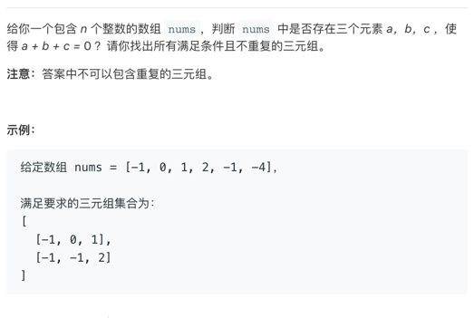
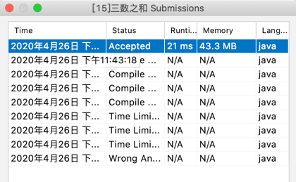

# 0427-java-三数之和-中等


开始上题，这是昨儿晚上做的，因为文档没整理出来，发出来晚了。

题目：



划重点：n个整数		数组		三个元素			a+b+c = 0	 不重复

#### 奉上思路：双指针

```
// Related Topics 数组 双指针
```

这也是官方给的思路。


#### 双指针：

双指针顾名思义，有两个指针，最经典的链表找中间值，链表有环等问题，由**「快慢指针」**解决。

还有一种可以**「左右指针」**，二分查找，滑动窗口都是利用了左右指针。

我们前面有一篇文章也利用了这个指针，请参照  [0420-java-盛最多水的容器-中等](https://mp.weixin.qq.com/s?__biz=MzA3NzgyNzA5NQ==&mid=2247483700&idx=2&sn=fc6d25d5832d6a34dadbc886a2495c86&chksm=9f4d5c4ca83ad55a0491fcb2dd0a69741c2a61af21c661e0593123771a64006d2688f14e330c&token=436714049&lang=zh_CN#rd) 这篇文章。


那这个题我们也用双指针的思路做一个解答。

考虑到要a+b+c=0 我们可以选定a作为固定数，b、c 由指针选定。

上一个例子吧：

```
[-1,-2,-3,0,1,2,3]
```

给定一个数组，按照题意分析那结果应该有下面这几种

```
[-3,0,3]
[-2,0,2]
[-1,0,1]
```

比较明确，指针思想上面有个大概的介绍了，那我们怎么选定这个 固定数a呢？


根据上面的例子我们大概可以了解到，如果是结果为0，如果排除都为0的情况下，必然有正负区分。

那我们是不是可以先把数组做个排序？

还是拿上面的例子说事儿：

``````
排序后：
[-3,-2,-1,0,1,2,3]
``````

这样是不是比较明确了，当固定数a>0的时候肯定不会出现 a+b+c =0 的情况了。

我们固定数a从最左侧取，依次+1取值。

左侧指针则取a的后一位开始，右侧则从数组的最右侧开始。当遇到满足情况的时候，我们就记录下这三个值。


#### 我们来看下代码吧


``````java
class a {
public static List<List<Integer>> threeSum(int[] nums) {
        //优先排序 这里使用快排吧  本来写了一个排序，然后提交一直说我超时，只能改了哈哈。
//        quickSort(nums, 0, nums.length - 1);
        Arrays.sort(nums);
        //然后依次循环 通过双指针 组成新的数组
        //记录返回值
  			List<List<Integer>> res = new ArrayList<List<Integer>>();
       
  			for (int i = 0; i < nums.length; i++) {
            //处理边界问题。
            if (nums[i] > 0) break;
						//计算左右指针位置
            int left = i + 1;
            int right = nums.length - 1;
          
            int key = nums[i];
            if (i > 0 && key == nums[i - 1]) continue;

            List<Integer> child = new ArrayList<Integer>();
            while (left < right) {

                int sum = key + nums[left] + nums[right];
                if (sum == 0) {
                    res.add(Arrays.asList(key, nums[left], nums[right]));

                    while (left < right && nums[left] == nums[left + 1]) {
                        left++; // 去重
                    }
                    while (left < right && nums[right] == nums[right - 1]) {
                        right--; // 去重
                    }

                    left++;
                    right--;
                }
                //这个处理是因为排序了 跟0 比较移动左右指针。
                if (sum < 0) left++;
                if (sum > 0) right--;
            }
        }
        return res;
    }
}

``````


最后上一张代码提交的图片




最开始的依次提交是写出来 了，没考虑去重，然后加了后 就开始超时。。。唉最后把代码改成上面的样子了。


