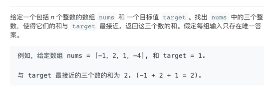

# 最接近的三数之和

先看题目：


好巧，跟 [0427-java-三数之和](https://mp.weixin.qq.com/s?__biz=MzA3NzgyNzA5NQ==&mid=2247483726&idx=1&sn=951571746dd3bf099104db01dcbf5eb6&chksm=9f4d5c36a83ad5206bfbfd9e9b5b12015c1cade8fd804e8ffff317eec60cf9752ed9ad97dd84&token=1321016570&lang=zh_CN#rd)  非常像。

解题思路也是一样的。如果你不是很清楚可以先看一下上面说的那一篇文章。

我这边也就简单的说明下区别的地方。
上一篇文章在于找相同的数，这一篇在于找距离最近。
怎么算距离最近呢，距离不存负值。
我们这边用了绝对值。
```
 /**
     * Returns the absolute value of an {@code int} value.
     * If the argument is not negative, the argument is returned.
     * If the argument is negative, the negation of the argument is returned.
     *
     * <p>Note that if the argument is equal to the value of
     * {@link Integer#MIN_VALUE}, the most negative representable
     * {@code int} value, the result is that same value, which is
     * negative.
     *
     * @param   a   the argument whose absolute value is to be determined
     * @return  the absolute value of the argument.
     */
    Math.abs()
```
双指针解法，选定基数，由指针移动更换数，计算出距离最近的数。
#### 边界
一种情况就是 计算值与target相等。直接返回就好了。

我就不多解释了直接粘上个代码吧。


```java
class Solution {
    public int threeSumClosest(int[] nums, int target) {
        Arrays.sort(nums);

        int min = nums[0] + nums[1] + nums[2];
        for (int i = 0; i < nums.length; i++) {
            int s = i + 1;
            int e = nums.length - 1;

            while (s < e) {
                int sum = nums[i] + nums[s] + nums[e];
                //此处判断差值 比对替换就好了
                if (Math.abs(target - sum) < Math.abs(target - min)) {
                    min = sum;
                }
                if (sum > target) {
                    e--;
                } else if (sum < target) {
                    s++;
                } else {
                    return min;
                }

            }
        }
        return min;
    }
}
``` 