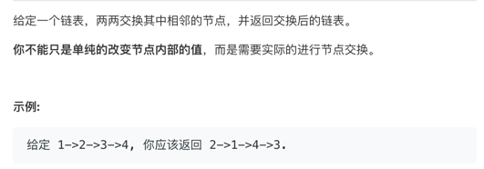
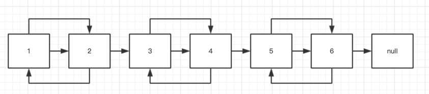
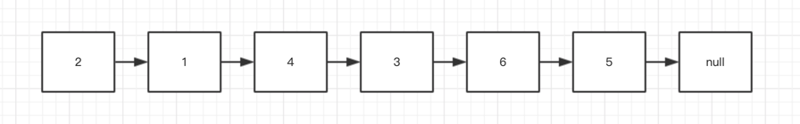
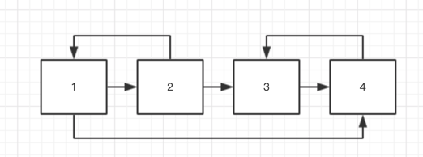
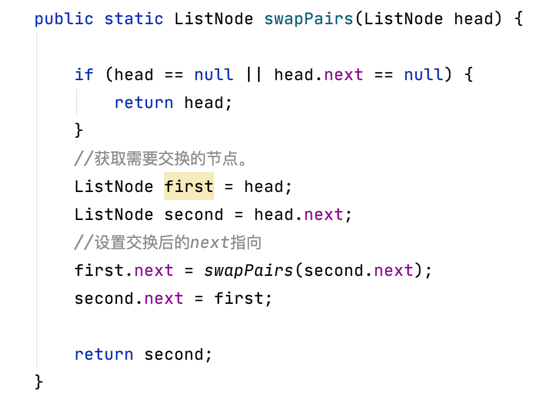

# 两两交换链表中的节点

我们来看下题目：

不知道大家有没有感觉哈，看到题呢，我想到了回溯，递归两种思路。

我不确定是不是对的，就是从题上考虑。节点交换就是要从当前节点找上一个节点。

上个图，看看逻辑

结果：

这道题最后我还是用递归解的。

#### 分析下解法

1、关键解题就是next指针的指向问题。
由上图例子，截取一段，我们看下。指针的过程好像变成了这样子。

2、如果我们把1->2->3->4 

拆解成开 1->2   3->4 就变成这样了。

然后交换后 2->1   4->3 

再拼接 2->1->4->3 

所以说我们要一次性拿到当前节点，以及当前节点的下一个节点。然后再做交换。

这样让我想到了数组的比较替换。

我想如果是遍历解题的话，应该就是有临时遍历进行替换赋值的。

#### 题解

