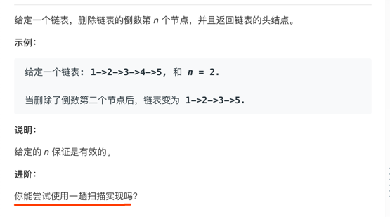
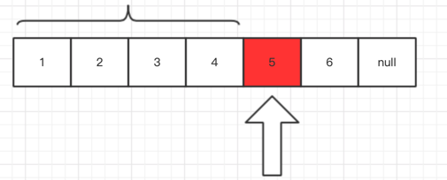
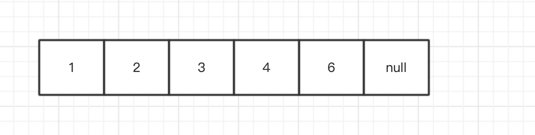
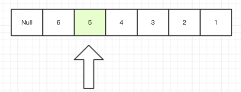
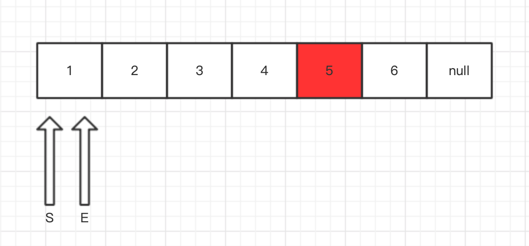
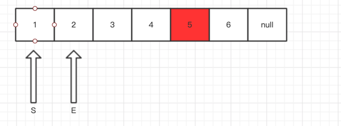
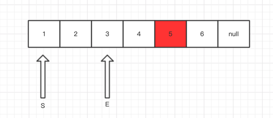
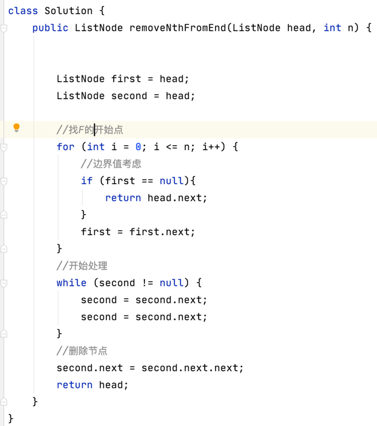

# 删除链表的倒数第N个节点

这道题是双指针的变种吧。我们先看题目




解读下题目，其实本质就是找链表的第N个点。但是这个题要删除第N个点，所以就是要找第N-1个点

这个题我第一想法就是双指针，但是后来琢磨了下，可以用类数学思想考虑下。

假设当前链表总长度是 m，那n的点就吧m 分成了两份。

假设n=2,从下图体现 5 是我们要删除的内容。



根据题的返回结果：


假设 从头结点 1到5 的距离为 m，总长度为len

那么m+n =len

那现在的问题是如何找到 n？

其实链表如果是下图的样子，我们是不是很轻松？


这就是我们的暴力解法了，两次循环就好了。

#### 我们现在要做的是一次循环。

假设我们现在有两个指针 ： F 和 S。
我们使 F 移动到链表尾部的长度 +n 等于链表总长度
然后使 F 跟 S 移动的长度一致即可找到对应的 N的位置



如何找到 F 的出发点？

我们从头结点找到开始找到N长度所对应的节点是不是可以作为F的开始点。

看图


其实看到图，再回头想一下刚才的思考，发现并不对。

当F从链表2 开始出发到6的时候 S 也会到5。

其实S是要拿到4位置，才能把4的next指针指向6

事实上，我们F开始点就要从中这里开始




#### 还有一个问题：边界值的考虑
当N恰好等于链表的长度 就是要删除头节点了
```
//找F的开始点
for (int i = 0; i <= n; i++) {
    //边界值考虑
    if (first == null){
        return head.next;
    }
    first = first.next;
}
```

上题解吧：




